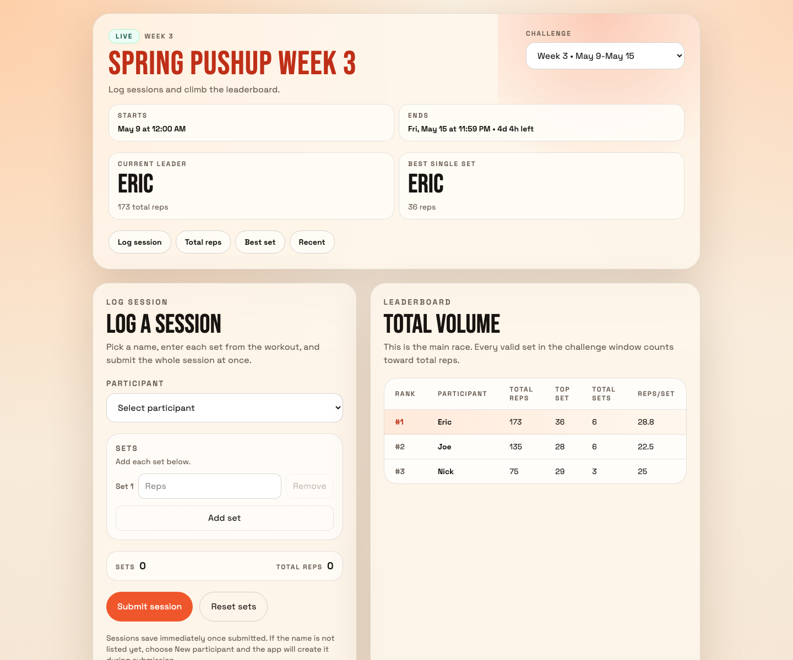

# Workout Challenge

Archived pushup challenge app for simple leaderboard-based fitness competitions.

This project is no longer an active product. The app is being decommissioned because it is not being used anymore, but the repository is kept as a reference for the 2026 workout challenge prototype: what it did, how it was structured, and how to run it again if needed.

## Screenshots



## What The App Does

The current app is a lightweight public pushup challenge tracker. It supports:

- a public challenge page
- active-or-latest challenge routing from the home page
- challenge date windows with stored week numbers
- participant selection and inline participant creation
- batch session submission with multiple sets
- total reps leaderboard
- best single set leaderboard
- recent session feed
- empty states when no data source or challenge data exists

The app is intentionally narrow. It was built around short weekly pushup challenges, not a full workout tracking product.

## Current Status

- Status: decommissioned / archived
- Production use: no active usage expected
- Maintenance posture: reference-only unless the project is revived
- Data model: Supabase-backed challenge, participant, session, and set tables
- Auth model: public honor-system submissions; no participant authentication

If this project is revived, the main product decision would be whether to keep it as a public challenge board or rebuild it around authenticated personal workout history.

## Stack

- Next.js
- React
- Supabase
- Tailwind CSS
- TypeScript

## App Flow

The root route loads the active challenge from Supabase. If no challenge is currently active, it falls back to the latest challenge. Once a challenge is found, the home page redirects to:

```text
/challenges/[slug]
```

The challenge page renders the selected challenge, leaderboard data, logging form, best-set standings, and recent submissions.

## Data Model

The Supabase schema centers on:

- `challenges`
- `participants`
- `sessions`
- `sets`

Weekly separation is stored on the challenge:

- `sessions.challenge_id` links each session to one challenge
- `challenges.week_number` identifies the week
- `challenges.start_at` and `challenges.end_at` define the valid window

There is no duplicate week number on `sessions`; the week is derived through the challenge relationship.

## Local Development

1. Install dependencies:

```bash
npm install
```

2. Create `.env.local`:

```bash
NEXT_PUBLIC_SUPABASE_URL=your-project-url
NEXT_PUBLIC_SUPABASE_PUBLISHABLE_KEY=your-publishable-key
```

The app also accepts `NEXT_PUBLIC_SUPABASE_PUBLISHABLE_DEFAULT_KEY` or `NEXT_PUBLIC_SUPABASE_ANON_KEY` if that is what the Supabase project exposes.

3. Run the app:

```bash
npm run dev
```

Open `http://localhost:3000`.

## Supabase Setup

Run these SQL files in Supabase:

1. `supabase/schema.sql`
2. `supabase/submit-session-function.sql`
3. `supabase/first-challenge.sql` if you want starter data with Eric, Joe, and Nick

For an existing database:

- run `supabase/get-or-create-participant-function.sql` once to support inline participant creation
- run `supabase/add-challenge-week-number.sql` once if the challenge table predates stored week numbers

## Resetting Data

- `supabase/reset-all-data.sql` wipes participants, challenges, sessions, and sets
- `supabase/first-challenge.sql` reseeds the original starter challenge
- `supabase/new-challenge-template.sql` can be copied when creating another weekly challenge

## Project Structure

- `src/app/` routes and API handlers
- `src/components/` challenge UI
- `src/lib/` Supabase client, challenge data loading, validation, rate limiting, and leaderboard utilities
- `supabase/` schema and SQL helpers
- `docs/screenshots/` archived product screenshots

## Notes For Future Reference

- Submissions are public and trust-based.
- Rate limiting is lightweight and in-memory.
- The app assumes one active or latest challenge as the primary surface.
- The UI is mobile-first but the challenge page remains readable on desktop.
- The screenshot data is representative sample data captured locally, not a guarantee of the current production database contents.
